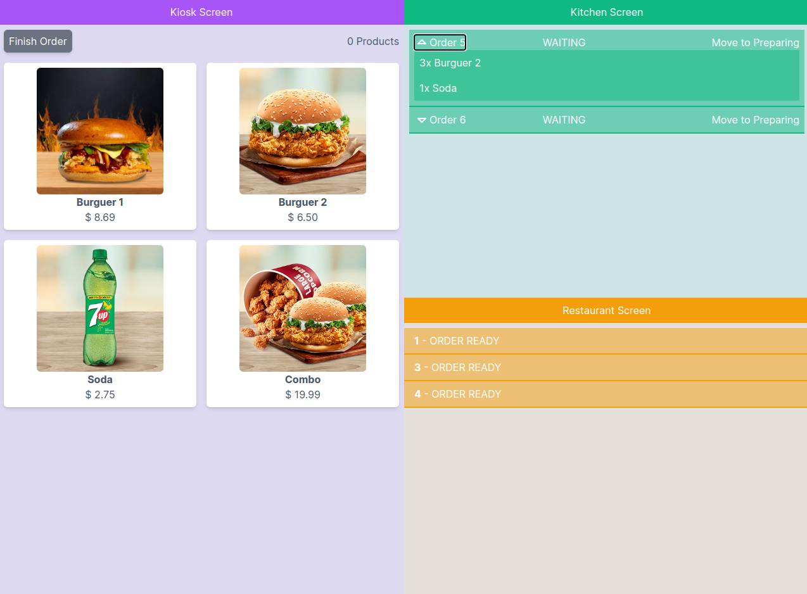

# KIOSK PROJECT - Frontend

With the screen divided into 3 parts, we simulate a self-service kiosk to select items, in another the kitchen screen, where we modify the status of the items, and in the third, the restaurant screen where users are shown the items ready to be picked up.

Live: <https://d1ymv3dztfmiyb.cloudfront.net/>

## Tech used

React / TypeScript / Tailwind - Consuming websocket from backend

AWS Amplify Hosting (S3 and CloudFront)

### Backend AWS

<https://github.com/gugazimmermann/nomad-cms>

## Install instructions - Linux

Make sure the backend is running

- run `npm install`
- Create the `./.env` file from `./.env.sample`
- run `npm start`
